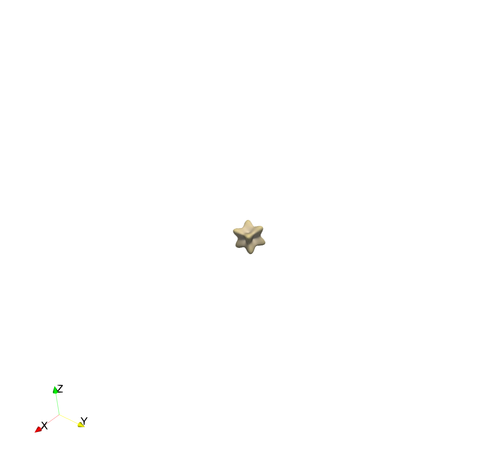
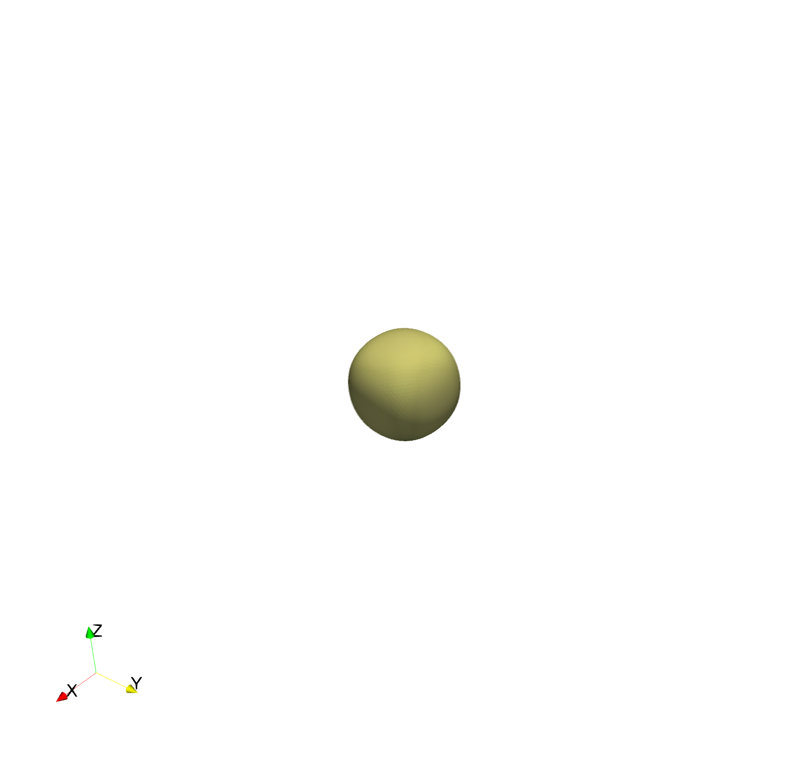
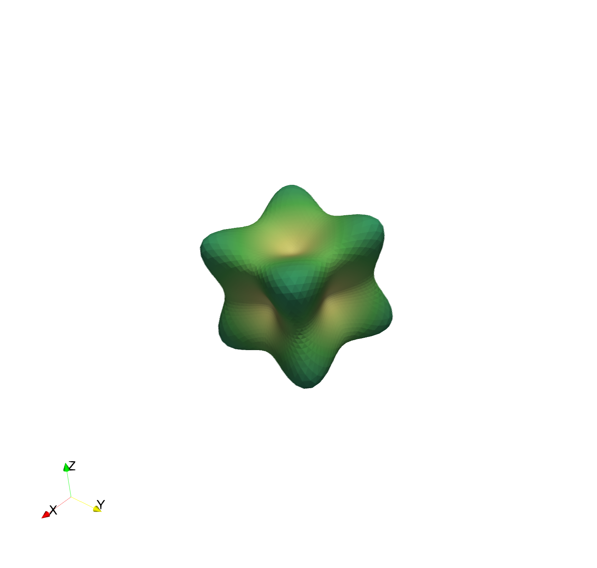
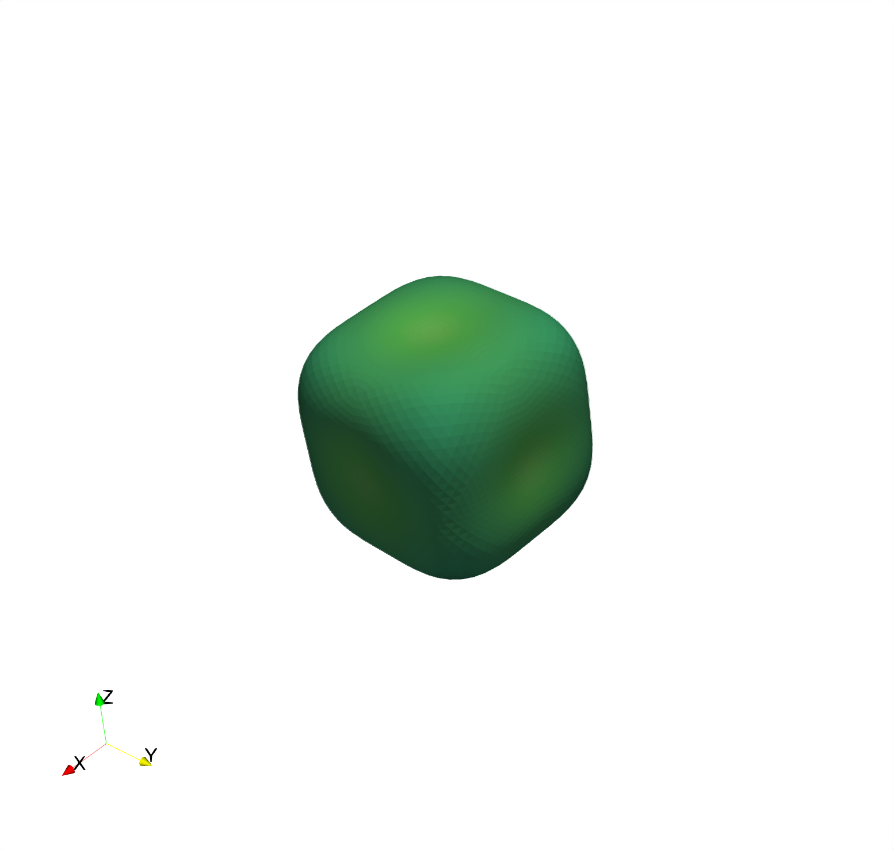
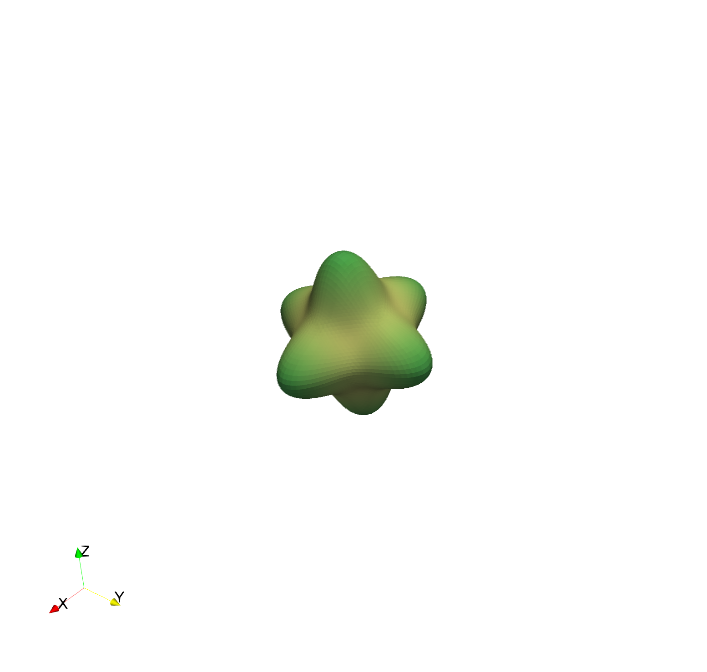
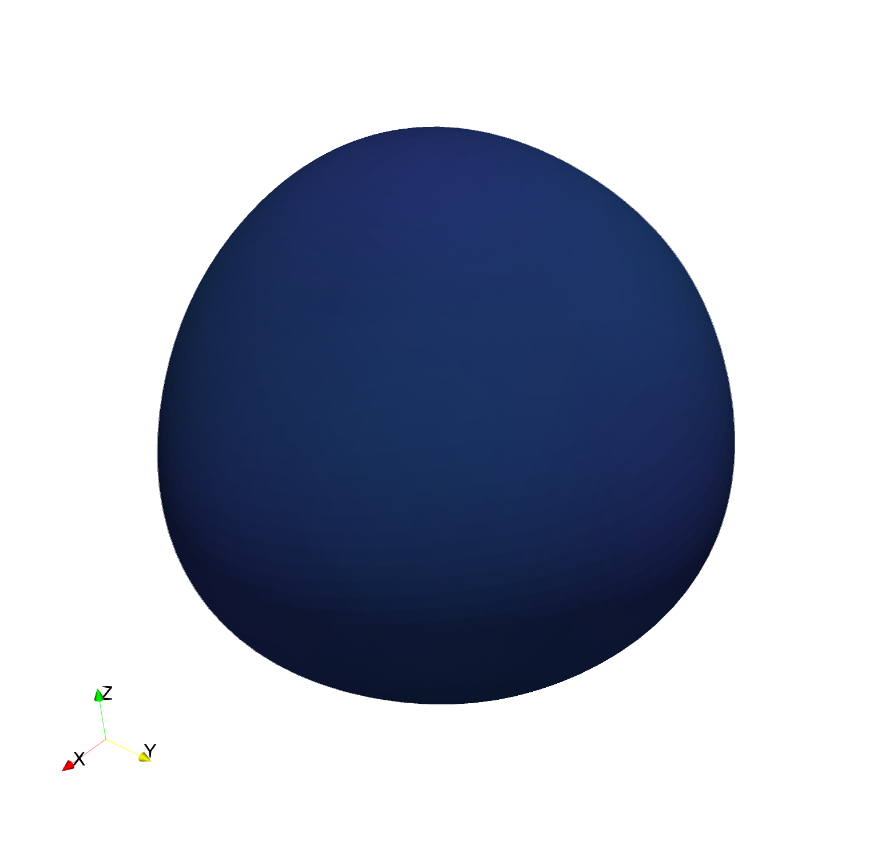

# elasticModulusVisualization
Generate either VTK or X3D representation of elastic modulus for different lattice symmetries.





```
usage: elasticModulusVisualization.py [-h]
                                      [-c {gray,grey,red,green,blue,seaweed,bluebrown,redgreen,bluered,blueredrainbow,orientation,strain,stress}]
                                      [-i] [-N RECURSION]
                                      [--symmetry {triclinic,monoclinic,orthorhombic,hexagonal,tetragonal,cubic,isotropic}]
                                      --c11 C11 --c12 C12 [--c13 C13]
                                      [--c14 C14] [--c15 C15] [--c16 C16]
                                      [--c22 C22] [--c23 C23] [--c24 C24]
                                      [--c25 C25] [--c26 C26] [--c33 C33]
                                      [--c34 C34] [--c35 C35] [--c36 C36]
                                      [--c44 C44] [--c45 C45] [--c46 C46]
                                      [--c55 C55] [--c56 C56] [--c66 C66]
                                      {vtk,x3d} name

positional arguments:
  {vtk,x3d}             output file format
  name                  output file name

optional arguments:
  -h, --help            show this help message and exit
  -c {gray,grey,red,green,blue,seaweed,bluebrown,redgreen,bluered,blueredrainbow,orientation,strain,stress}, --colormap {gray,grey,red,green,blue,seaweed,bluebrown,redgreen,bluered,blueredrainbow,orientation,strain,stress}
                        colormap for visualization
  -i, --invert          invert colormap
  -N RECURSION, --recursion RECURSION
                        number of recursive refinement steps
  --symmetry {triclinic,monoclinic,orthorhombic,hexagonal,tetragonal,cubic,isotropic}
                        crystal structure symmetry
  --c11 C11  --c12 C12  --c13 C13  --c14 C14  --c15 C15  --c16 C16
             --c22 C22  --c23 C23  --c24 C24  --c25 C25  --c26 C26
                        --c33 C33  --c34 C34  --c35 C35  --c36 C36
                                   --c44 C44  --c45 C45  --c46 C46
                                              --c55 C55  --c56 C56
                                                         --c66 C66
```
